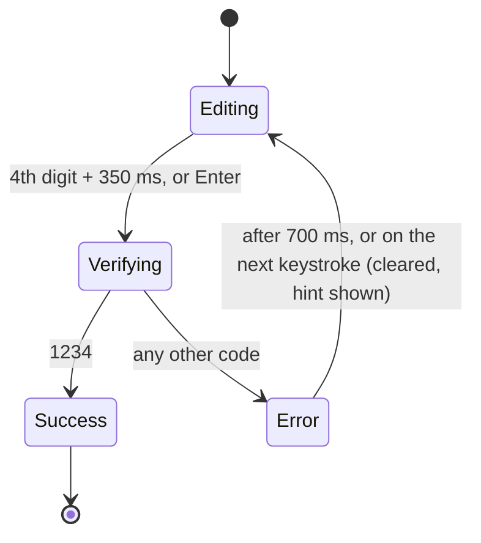

# Passcode entry

A 4-digit passcode screen, like the code you type to mirror a laptop to an Apple TV. Built for a
design-engineering take-home: the focus is on the states and the transitions between them.

**The correct passcode is `1234`.**

## Run it locally

Requires **Node 20.19+ or 22.13+** and npm.

```bash
git clone https://github.com/yutongchen0922/passcode_flow.git
cd passcode_flow
npm install
npm run dev
```

Open <http://localhost:5173> and start typing. You can also click anywhere on the page first.

| Script               | What it does                                                                      |
| -------------------- | --------------------------------------------------------------------------------- |
| `npm run dev`        | Dev server at `localhost:5173`                                                    |
| `npm test`           | Unit and interaction tests (Vitest + Testing Library)                             |
| `npm run typecheck`  | TypeScript, strict                                                                |
| `npm run build`      | Type-check and production build to `dist/`                                        |
| `npm run preview`    | Serve the production build                                                        |
| `npm run pixel-diff` | Compare each screen with the Figma frames (see [Pixel fidelity](#pixel-fidelity)) |

### Things to try

- **`1234`**: "Verifying..." for 2 seconds, then "Authenticated". Reload to start again.
- **Any other code**: the field turns red and shakes, then clears, and the passcode appears as faint ghost digits to type over.
- **`?slowmo`**, e.g. `localhost:5173/?slowmo`: every transition at 1/5 speed.
- **`?preview=<state>`**: static screens.
  - Figma frames: `empty`, `filling`, `verifying`, `authenticated`
  - States Figma doesn't show: `tile-first`, `tile-last`, `error`, `error-cleared`, `error-retyping`

## The brief, rule by rule

Each rule has a test with the same name in `src/passcode/__tests__/PasscodeEntry.test.tsx`.

| Rule                                         | How it behaves                                                                                                                                                                      |
| -------------------------------------------- | ----------------------------------------------------------------------------------------------------------------------------------------------------------------------------------- |
| 1 · Only 0–9                                 | Other keys are ignored, and the focused cell gives a small wiggle. Pastes and SMS autofill keep only their digits (`12-34` → `1234`). Full-width digits (`１２３４`) are converted. |
| 2 · Submission takes a few seconds           | Mock verification in `verify.ts` takes 2 s.                                                                                                                                         |
| 3 · Pixel-perfect                            | Checked with a pixel diff against Figma exports; see [Pixel fidelity](#pixel-fidelity).                                                                                             |
| 4 · Passcode `1234`                          | `CORRECT_PASSCODE` in `verify.ts`.                                                                                                                                                  |
| 5 · Enter submits                            | Submits immediately. With fewer than 4 digits it doesn't submit; focus jumps to the first empty cell.                                                                               |
| 6 · Typing advances focus                    | The tile glides to the next cell. On the last cell it stays.                                                                                                                        |
| 7 · Backspace/Delete clears the current cell | The digit fades out and focus stays on the cell.                                                                                                                                    |
| 8 · On an empty cell, Backspace moves back   | Focus moves to the previous cell without clearing it.                                                                                                                               |
| 9 · Holding Backspace keeps clearing         | Key repeat alternates move / clear back to the first cell.                                                                                                                          |

## States and transitions



| Moment | What you see |
| --- | --- |
| Page load | Exactly the Figma empty frame, with no tile. The first click or keystroke brings in the green tile. |
| Typing | The digit comes into focus: a quick fade up from a slight blur, with no bounce. The tile glides to the next cell (140 ms), rounding its corners on the end cells. |
| Fast typing, held keys | No animation: when keys arrive under 120 ms apart or auto-repeat, the tile and digits update instantly, so they never trail behind your fingers. |
| Code complete | A 350 ms pause on the full code, so the last digit is seen. Then the tile opens out to wrap the whole code ("checking all of it") and fades as the cells turn grey and "Verifying..." rises in. |
| Verifying | The spinner breathes: its eight spokes draw in towards the centre and back out while it turns slowly. |
| Success | The spinner exhales, its spokes drawing into a point. The field recedes into a soft blur while the message glides 96 px down to the centre on a spring. "Authenticated" comes into focus, the box blooms out of the point where the spokes met, and the tick draws in. |
| Wrong code | The frame turns red and the field shakes once, and "Incorrect passcode" appears. After 700 ms the tile closes back onto cell 1, each digit fading as its edge passes, and the passcode appears in the empty cells as faint ghost digits. Typing during those 700 ms starts the next attempt at once, so no keystrokes are lost. |
| Reduced motion | Fades only: no glides, pops, shakes, wrap, breathing or bloom. The spinner still turns. |

Text swaps blur slightly as they crossfade (the status message and digits), which hides the
letterforms changing.

### Decisions

- **The green tile is the selected cell: where the next digit goes.** This follows rules 6–8.
  - Figma's "filling" frame (tile on a filled cell 3) is the instant a digit lands, just before the tile moves on.
  - It's also what you see after one Backspace, or after clicking a filled cell.
- **Auto-submit with a short pause.** There's no submit button in Figma, so a complete code submits by itself after 350 ms.
  - Enter skips the pause.
  - Any edit during the pause cancels it, so rules 5 and 7 still apply to a full code.
- **Focus never skips ahead.** Clicking past the first empty cell lands on the first empty cell.
  - The field is a single Tab stop.
  - Arrow keys, Home and End move between cells.
  - ⌥⌫ / ⌘⌫ clears the whole code, with the same closing motion as the error.
- **The error state and hint aren't in Figma.**
  - They reuse the existing tokens plus one red, `#b42318`, on the cell strokes only.
  - The hint is the passcode as ghost digits (`#c2c2c2`) in the empty cells, exactly where each digit will land. It needs no extra line of text, and typing simply replaces it.
  - It shows only after a wrong code, so the four Figma states stay untouched. Screen readers get it as a sentence.
- **Status messages fade before they swap.** "Verifying..." and "Authenticated" rows differ in width by 41 px. Swapping only while nothing is visible means nothing is seen to jump sideways.

## Pixel fidelity

`tokens.css` mirrors the Figma variables 1:1 (`--fill`, `--border`, `--highlight`, …). Values not in
Figma are grouped separately and marked.

`npm run pixel-diff` needs the dev server running and Google Chrome installed. It uses the macOS path; set `CHROME_PATH` elsewhere. The script:

1. screenshots each Figma state at the frame size, 1512×982, and
2. compares it with the exports in `design/figma/`.

It fails only if a difference is new:

| State         | Result                                                                                              |
| ------------- | --------------------------------------------------------------------------------------------------- |
| empty         | Exact match                                                                                         |
| filling       | ~125 px: Figma placed two digits by hand, 1 px off the others                                       |
| verifying     | ~740 px: the Figma frame has the field 1 px higher. It stays put here so it doesn't jump on submit. |
| authenticated | ~130 px: text anti-aliasing only (Figma vs Chrome)                                                  |

What measuring against the exports turned up:

- **Figma renders with Inter 3.x.** Inter 4 changes several character widths by 2–3 px, so the app bundles Inter 3.
- **Measured offsets.** Digits sit 1.5 px right of centre in Figma, and status labels 1 px higher than Chrome draws them. Both are tokens.
- **Tile shadow.** It shows over the previous cell but not the next one, which Figma draws on top. The shadow is clipped to match.
- **Whole pixels.** The field snaps to whole pixels, so 1 px strokes stay sharp at any window size.

## Code organisation

```
src/
  styles/tokens.css        Figma variables (1:1), measured geometry, motion tokens
  styles/global.css        Inter 3 @font-face, reset, the ?still switch
  passcode/
    machine.ts             Pure state machine: state, actions, reducer, view selector
    usePasscode.ts         Connects the machine to the DOM (keys, paste, focus) and to time
    input.ts               Key → action mapping, digit cleaning
    verify.ts              Mock verification: 2 s, accepts 1234
    config.ts              Interaction timings (auto-submit pause, error hold, …)
    types.ts               Shared types, including PasscodeView: everything the screen renders
    PasscodeEntry.tsx      The live screen: usePasscode + PasscodeScreen
    PasscodeScreen.tsx     Layout: status row and field, success layout
    PasscodeField.tsx      The four-cell bar and the moving tile
    DigitCell.tsx          One cell: transparent input, animated digit, ghost hint digit
    StatusRow.tsx          Icon + label, fading out before swapping
    *.module.css           One stylesheet per component; states via data-* attributes
    icons.tsx              Spinner and check drawn inline with Figma's geometry, so parts animate
    __tests__/             Machine, key mapping, and one test per rule
  preview/Preview.tsx      Static screens for ?preview= and the pixel diff
scripts/pixel-diff.mjs     Figma comparison
design/figma/              Figma frame exports used by the pixel diff
```

- **`machine.ts` is plain logic.** It has no React, DOM or timers, so every rule is a plain function you can test.
- **Components only render.** They set `data-*` attributes and the CSS handles every visual state and transition.
- **No inline styles.** Colours, durations and measured sizes are tokens in `tokens.css`; the few animation amplitudes (shake distance, wiggle) sit next to the keyframes they tune.

## Accessibility

- **Inputs:** each is labelled "Digit n of 4", opens the numeric keyboard on mobile, and supports one-time-code autofill.
- **Screen readers:**
  - The status message is announced (`aria-live`).
  - Inputs are marked `aria-invalid` on a wrong code.
  - The hint is announced as a sentence when it appears; the ghost digits are visual only.
- **Reduced motion** replaces the glides, shake, wrap, breathing and bloom with fades. The spinner still turns.
- **Mobile:** text is 16 px or larger, so iOS doesn't zoom in on focus.

## Known limitations

- **Android keyboards:** on some, Backspace on an _already empty_ cell doesn't move back. The keyboard sends no event when there's nothing to delete. Desktop and iOS follow the spec.
- **The hint gives away the passcode.** It's there so reviewers can reach the success state; a real product wouldn't do this.
- **Very narrow screens.** The layout is Figma's fixed 336 px field, so it fits phones from 368 px wide. The oldest 320 px phones clip the edges.
- **Built for four digits.** The styles give each cell its own edges, to match Figma's dividers exactly, so they assume four cells. The code length itself is one constant, `CODE_LENGTH`.
- **No restart after success.** Reload to start again; the Figma frame has no reset control.
